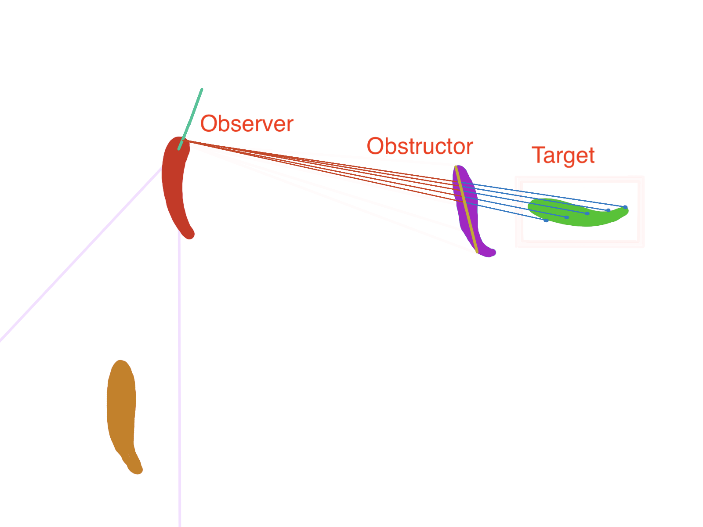
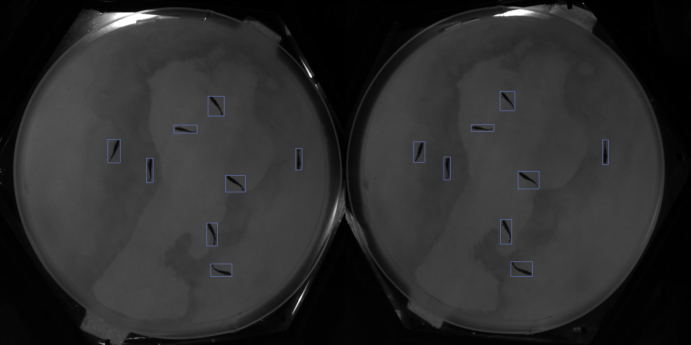
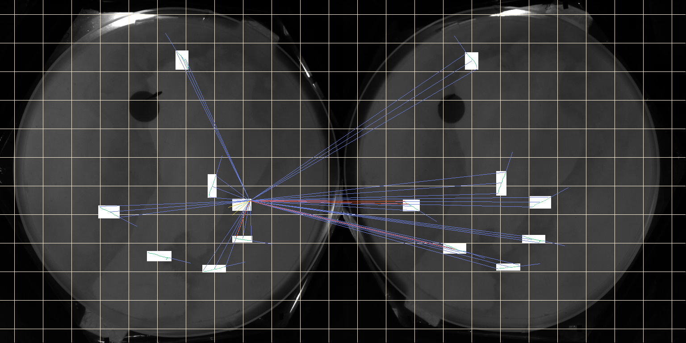
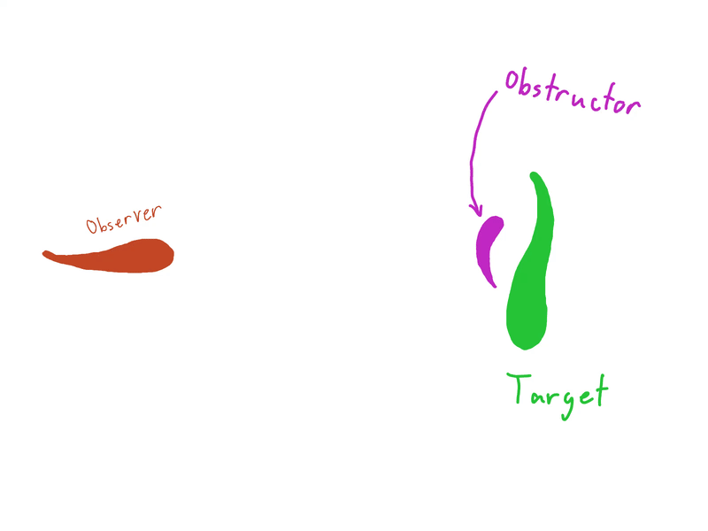

This video covers how the **FishView.py** script works  
<iframe width="560" height="315" src="https://www.youtube.com/embed/nN6tXBsJKyY?si=RchYc5NgNrYmx5e_" title="YouTube video player" frameborder="0" allow="accelerometer; autoplay; clipboard-write; encrypted-media; gyroscope; picture-in-picture; web-share" referrerpolicy="strict-origin-when-cross-origin" allowfullscreen></iframe>

# Goal
The goal of this code was to write an algorithm that would rapidly determine if each fish (*observer*) could see a *target* or if that *target* was covered by an *obstructor*. An example can be seen below.


# Process - Whoops
## How Raycasting Normally Works
Raycasting—as seen in many video games—is meant to resolve whether one object is obstructed relative to another object with respect to sight. In the above diagram we can see how the target is obstructed by the obstructor from the view of the observer. In standard ray casting algorithms (made for video games) the precise dimensions of the observer, obstructor, and target are known. The projection of the rays onto the shapes making up the obstructor and target can be calculated directly.  

## How This Application Differs
The dimensions of the fish are not already known; the neural network creates bounding boxes around fish. From these, estimates are made of the fish pixels by fitting a distribution to the background and selecting only pixels that are unusually dark (see the example below).    
We can either use raycasting with the bounding boxes (**very** fast but not precise) or use the the fish pixels to get a more precise estimate of which fish can be seen.  
If we want to use the fish pixels, we still need a way of creating a simpler shape for the fish (unless we want to check each pixel individually). We have 2 options: we can either use a method similar to [gift-wrapping](https://en.wikipedia.org/wiki/Gift_wrapping_algorithm) or we can find the silhouette of each fish—a line segment in 2D space—relative to the observer.  
Each has their own advantages. Gift-wrapping only happens once for each fish; determining the silhouette of a fish relative to the observer happens $n*(n-1)$ where $n$ is the number of fish. Determing the silhouette is very quick as it can be done with vectorized functions in numpy and only requires checking the corner pixels of each fish rather than every pixel. Raycasting with polygons also requires [point-in-polygon (PIP)](https://en.wikipedia.org/wiki/Point_in_polygon#:~:text=One%20simple%20way%20of%20finding,an%20even%20number%20of%20times.) checks while raycasting with the silhouette only requires finding the intersection of the ray and 2 other line segments (very fast).  
The code linked at the bottome uses the second method—determining the silhouette of each fish relative to the observer.

## Silhouette Method
For each observer -> target -> potential obstructor ($n(n-1)(n-2)$ operations) determine if the silhouette (line segment) of the obstructor obstructs the target fish from the observer fishes view. See pseudocode below:
```python
for observer:
    silhouettes = [line_segment for other_fish in picture]
    for target:
        cast rays and store contacted points
        for obstructor:
            for ray in rays_remaining:
                if ray contacts obstructor first:
                    remove ray from rays_remaining
            target is approx rays_remaining / rays_cast visible
```
*This pseudo-code does skip some steps, e.g. ignoring fish that are outside of the observers vision range*  

The script debugger gives a visualization of how this looks from the perspective of one observer with 3 rays cast per target fish.  

Here is the raw image:   

Here is the image with each fish's direction and the view rays from the observer marked: 


# Results
This script gives precise information about each fish with minimal raycasts. The precision is easily controllable via the number of rays, allowing the user to choose between speed and more granular information.  
That said, the script is still slower than I'd like and there is a way to retain a high level of information while keeping the script (relatively) fast.

# How to Improve
Instead of tracking the number of rays that hit each fish (or are obstructed) another option would be to track the angular profile of the fish and reduce that based on occlusions from obstructing fish. The animation below shows an example of a sub-optimal case of this where the angular profile must be split into multiple segments.

The video at the beginning of the article also reviews using angular profiles.  
This method does have drawbacks. In addition to having to track multiple angular profiles in sub-optimal cases it also has a more difficult time resolving complex occlusions—e.g. one fish is partially wrapped around the other or they cross eachother—which the raycasting method does not.