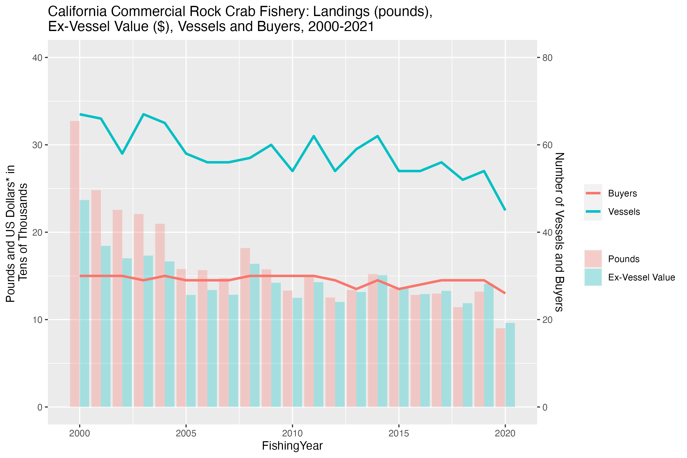
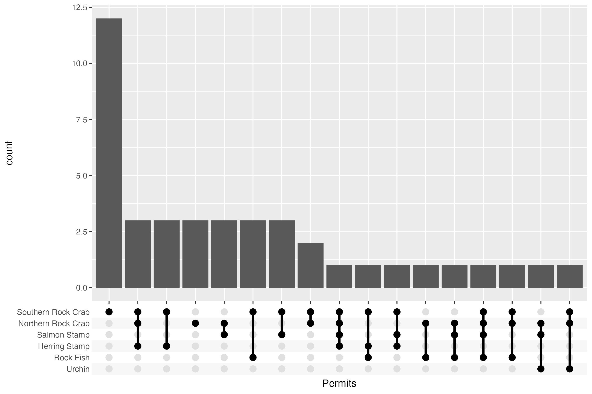

**DISCLAIMER!** - All data used to generate tables or graphs for this illustration of my work is **FAKE**. Due to privacy concerns, I cannot legally show these figures with the data from the actual fishermen.


# Data Summary
### Variables Used
*Not all variables in the CDFW (**C**alifornia **D**epartment of **F**ish and **W**ildlife) files we used were used by me. The ones described below are most of the ones I worked with.*
## Fishermen Landings Data
These data contain records of fishtickets submitted by fishermen on upon selling to a particular business. A separate ticket must be issued for each species sold by the fisheremen.


Variables provided with the dataset:  

| Variable | Description |  
| ---------------- | ------------- |  
| **LandingReceiptNum** | Landing Receipt Number, a unique identifier for each fish ticket |  
| **LandingDate** | The date the fishticket was submitted |  
| **FisherID** | Unique identifier for each fisherman submitting a fishticket |  
| **Pounds** | Weight of all the fish caught for that specific ticket. |  
| **UnitPrice** | The price per pound of fish for that species. Generally used to check that the **Pounds** and **TotalPrice** made agreed |  
| **TotalPrice** | The total price the fisherman charged a business for selling their fish |  
| **SpeciesGroup** | Which species group the fish belong to. This is **NOT** the same as species; these are CDFW defined groups created based on organizational and conservational purposes. |  
| **GearGroup** | The method of catching the fish. E.g. trap, trawling, longline, etc |  
| **FishingYear**\* | The CDFW fishing year is April 1st to March 31st of next year, this adjusts the year so a **FishingYear** of 2016 refers to April 1st, 2016 to March 31st, 2017. A fishticket submitted on February 14th 2012 will be in **FishingYear**: 2011 |  

# Graphs
## General Fishery Overview
**Reminder**: The data used to generate this graph are fake. No conclusions should be drawn from any supposed trends in the graph.
```r
# adjust pounds and adjusted value so they both fit
adjusted_table <- task0_summary_rcrab %>% 
  mutate(
    Pounds_Adj = Pounds / 500, 
    Value_Adj2 = Value_Adj / 500
  )
adjusted_table <- adjusted_table[c('FishingYear', 'Pounds_Adj', 'Value_Adj2', 'Vessels', 'Buyers')]

adjusted_table <- melt(as.data.frame(adjusted_table), id = 'FishingYear')
adjusted_table <- adjusted_table[(adjusted_table$variable == 'Pounds_Adj') | (adjusted_table$variable == 'Value_Adj2'),]

scale_coef = 1/2
adjusted_table$variable <- relevel(adjusted_table$variable, 'Value_Adj2')
ggplot(adjusted_table, aes(x = FishingYear, y = value)) + 
  geom_bar(aes(fill = variable), stat="identity",position = "dodge", alpha=.3) +
  geom_line(data = task0_summary_rcrab, aes(y=Vessels * scale_coef, color='Vessels'), size = 1.1) + 
  geom_line(data = task0_summary_rcrab, aes(y=Buyers * scale_coef, color= 'Buyers'), size = 1.1) +
  scale_y_continuous(
    name = "Pounds and US Dollars* in \nTens of Thousands", 
    limits = c(0, 40),
    sec.axis = sec_axis(~. / scale_coef, name = "Number of Vessels and Buyers")
  ) +
  theme(legend.title = element_blank()) +
  scale_fill_discrete(labels = c('Pounds', 'Ex-Vessel Value')) + 
  ggtitle('California Commercial Rock Crab Fishery: Landings (pounds), \nEx-Vessel Value ($), Vessels and Buyers, 2000-2021')
```

While there are a number of data science sins in this graph—dual axes, combined graph modes, and category bloat *within* axes—this was how the previous year's report organized their data.

## Permit Mixes 
The upset plot below demonstrates how permit combinations could be illustrated. This particular upset plot is *semi-inclusive* which means any individual who has possessed all permit types in the combination for the time frame is included in the group. For example, a fisherman with *Salmon Stamp*, *Northern Rock Crab*, and *Urchin* permits would be included in the *Northern Rock Crab* and *Urchin* category. If the graph was *distinct* only individuals with **just** those permits would be included. If the graph was fully inclusive any individual who possessed a *Northern Rock Crab* or *Urchin* permit would be included.
```r
permits %>% 
  filter(FishingYear >= 2010 & FishingYear < 2020) %>% 
  drop_na() %>% 
  inner_join(rcrab_permitted %>% select(-PermitName), by = c('FishingYear' = 'FishingYear', 'CFL' = 'CFL')) %>% 
  group_by(CFL) %>% 
  distinct(CFL, PermitName, .keep_all = TRUE) %>% 
  summarise(Permits = list(PermitName)) %>% 
  ggplot(aes(x = Permits)) + 
  geom_bar() + 
  scale_x_upset(n_intersections = 20)
```
(**Fake**) Permit Mixes among Fishermen possessing a (North or South) *Rock Crab* Permit for 2010 - 2020



