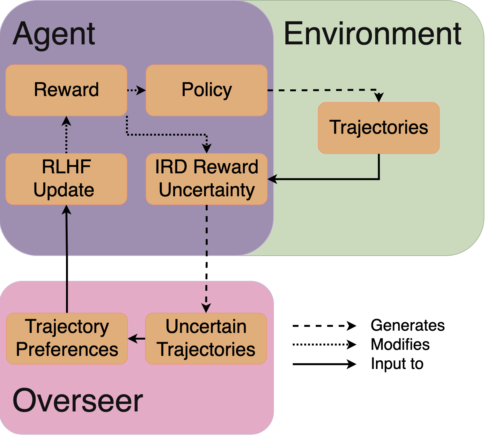
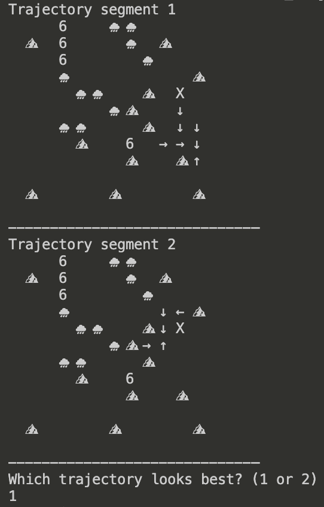

This was a project I worked on with two classmates—Khadija Irfan and Keyan Rahimi. We may explore further refining the concept for a conference in the future. This is largely copy-pasted from our final report. Our professor requested we format it according to ACM specifications; we have **NOT** (yet) published this. The code for this project may be found on [my github](https://github.com/SamNelsonData/BayesianTrajectorySelection).

# Abstract
Current implementations of reinforcement learning with human feedback (RLHF) generally rely on ensembled rewards or variance-from-dropout methods to estimate reward uncertainty for trajectories [2]. Our approach models the reward function as a random variable dependent on a proxy reward and the MDP/R environment to estimate the reward uncertainty. This method, taken fromInverse Reward Design by Dylan Hadfield-Menell, hopefully allows for significant improvements in trajectory selection allowing agents to learn more quickly.

# Introduction
Reinforcement learning with human feedback (RLHF) has gained significant popularity for its ability to train complex reward func-
tions that are difficult to specify directly. Through overseer-preference labels of trajectory segments, complex reward functions may be learned. The selection of trajectory-segments has relied on two approaches: ensembled reward functions and dropout variance. These methods approximate trajectory reward uncertainty to ensure labels provide useful training information for the reward model. Ideally,
the algorithm "knows-what-it-knows" [4] allowing the algorithm to select trajectories that will best expand its knowledge. Inverse Reward Design, a technique for reward estimation, was designed specifically for this purpose, and is what we decided to apply in our
work. In this paper, we will discuss the relevant work surrounding RLHF as well as the current approaches to trajectory selection, and how we instead propose using Inverse Reward Design’s state uncertainty estimation to select uncertain trajectories. We will then show our results and discuss their implications, as well as future work and limitations.

# Relevant Work
## Reinforcement Learning with Human Feedback
Reinforcement learning with human feedback (RLHF) is an increasingly popular technique for training complex reward functions that are difficult to specify but correct behavior is easily recognized by an overseer \[4\]. The goal is to train a reward function that can consistently predict the trajectory that would be preferable to a human. I.e., for any trajectory-segment pair, $\sigma_1 \succ \sigma_2$ and (perfectly) optimized reward function $R(\sigma)$, $R(\sigma_1) > R(\sigma_2)$.  
In practice this involves minimizing the cross-entropy loss between the true preferences and the inferred preferences. An important component to this is how trajectories are selected for comparison.  

## Current Approaches to Trajectory Selection
In reinforcement learning, trajectory selection has traditionally been framed as a consequence of the agent’s interaction with the environment under a fixed reward function. In the classical formulation presented by Sutton and Barto, trajectories are evaluated according to the cumulative return by the environment’s reward signal, and learning dynamics are driven by value or policy updates that prioritize trajectories with higher expected return. \cite{sutton2018reinforcement}. This formulation assumes that the reward function is known, stationary, and correctly specified. Under this assumption, uncertainty in trajectory evaluation doesn’t come from ambiguity in the reward itself.  
  
In contrast, RLHF introduces a learned reward model trained from human preferences. Because the reward function is inferred rather than given, modern RLHF pipelines have to account for uncertainty in reward predictions when evaluating trajectories. One widely adopted approach models this uncertainty using ensembles of reward networks. In these methods, multiple reward models are trained independently, and the reward assigned to a trajectory is aggregated across ensemble members by taking the mean of predicted returns \[4\]. The variance across ensemble predictions is used as a replacement for uncertainty, which lets people identify trajectories where reward estimates are unreliable and to modulate policy updates accordingly.  
  
Similarly to ensemble methods are dropout based uncertainty estimation techniques, which interpret dropout at as approximate Bayesian sampling over model parameters. By enabling dropout during reward evaluation and sampling forward passes, you can obtain a distribution of predicted rewards for the same trajectory, like drawing samples from a posterior over reward functions \cite{gal2016dropout}. These methods are appealing due to their computational efficiency relative to full ensembles, as they reuse a single trained model. In RLHF settings, dropout based uncertainty has been used to guide trajectory selection and to reduce overoptimization of reward models during policy learning.  

## Inverse Reward Design
Inverse Reward Design (IRD) is a technique developed by Dylan Hadfield-Menell, Smitha Milli, Pieter Abbeel, Stuart Russel, and Anca D. Dragan. IRD provides a method for estimating reward uncertainty when the state features are ambiguous.  

In Hadfield-Menell et al.'s paper \[4\], IRD was used to avoid states that had not been foreseen by the reward designer. The agent tracked the distribution of rewards (directly dependent on noisy features). When the variance of the reward distribution increased, the agent assumed this to be an unanticipated state and would avoid it.  
While useful, the experiment in the paper mainly demonstrated the agent's ability to avoid unknown states; a task that could have been accomplished through analyzing the variance of the features of each state. We propose using IRD's state uncertainty estimation to select trajectories for which the reward function has the least certainty. Our hypothesis is that \textbf{trajectory-selection using IRD reward uncertainty estimation will result in fewer necessary labels to train the reward function then random or ensemble trajectory selection methods}.  

# Methodology
  
Our approach uses IRD to select uncertain trajectories to maximize the benefit of the laborious preference labeling step. In the diagram above, our reward function trains a policy which is then used to generate trajectories. These trajectories are evaluated by the reward posterior distribution (from IRD) dependent on the environment and the current reward function. Uncertain trajectories are passed to the overseer who labels their preferences. These preferences are then used to update the reward function which updates the policy and so on.  
Maintaining the noisy posterior allows us to continue estimating the uncertainty of various trajectories. Weighting the posterior samples with the lowest loss allows us to progress toward a more optimal reward function.  

## Posterior Sampling Update Algorithm
<html>
    
    

        <pseudo-code>
            <b>Require</b> trajectory segments s1, s2, and preference 𝜇  
            <b>Resample Candidates</b>:  
            <pseudo-code style="margin-left:20px">
                <b>For</b> proxy weight <i>w</i> and 𝜇  
                <pseudo-code style="margin-left:40px">
                    s1, s2 = <i>w</i>·s1, <i>w</i>·s2  
                </pseudo-code>
                <pseudo-code style="margin-left:40px">
                    <b>Calculate</b> <i>wLOSS</i> = ln(sigmoid((s1 - s2)·(-1)𝜇))  
                </pseudo-code>
            </pseudo-code>
            <pseudo-code style="margin-left:20px">
                <b>Resample</b> <i>w</i> according to <i>wLOSS</i>  
            </pseudo-code>
            <pseudo-code style="margin-left:20px">
                <b>Add Noise</b>
            </pseudo-code>
        </pseudo-code>
    

</html>

## Experimental Design
For our testing environment we used SciWrld, a made up simulation where a solar-powered rover explores a landscape collecting seeds. Impassible mountains and dark clouds create fixed and dynamic obstacles. Being solar-powered, the rover loses the ability to move after spending more than one cycle under the clouds. The rover must navigate the clouds and the mountains in order to collect as many seeds as possible.  
The reward function we use tracks the features seeds collected, time under clouds, battery depletion events, tiles covered, and final battery. We begin with a multivariate Gaussian prior with means (10.0, -1.0, -5.0, -0.5, 2.0) and standard deviation 1.0. Each mean corresponds with the previously mentioned features.

  
Above we have an example of how our trajectories are sampled in SciWrld. The agent ('X') and its trajectory (the arrows) are shown in relation to the environment which includes mountains, clouds, and seeds ('6'). The first trajectory explores more (neither acquires a seed) so we mark the first trajectory as preferable.  

# Results
We evaluated BRITE on SciWrld using simulated human preferences derived from a ground-truth reward function. The simulated oracle always selects the trajectory with higher true reward, providing a noise-free baseline for evaluating our reward learning approach. We collected 30 pairwise preferences using uncertainty-guided trajectory selection. 

## Reward Learning Performance
Table 1 summarizes our main results after 30 preference labels.  

| Metric | Value |
|--------|-------|
| Ranking Accuracy | 96% |
| Spearman Correlation | .998 |
| Pearson Correlation | .670 |
| Uncertainty Calibration | .99 |
| Mean Absolute Error | .587 |  

**Table 1** - BRITE Performance over 30 preference labels.  
\\
**Ranking Accuracy** - Our learned reward function correctly predicts human preferences on 96% of held-out trajectory pairs (24/25). This metric directly measures the goal of RLHF: learning a reward that agrees with human judgment.  
**Correlation with True Reward** - The Spearman correlation of 0.998 indicates near-perfect rank preservation-trajectories are ordered almost identically to ground truth. The lower Pearson correlation (0.670) reflects scaling differences in absolute reward values, which do not affect preference prediction.  

## Uncertainty Calibration
A key advantage of our Bayesian approach is meaningful uncertainty estimates. We measured calibration by correlating predicted uncertainty with actual prediction error. The correlation of 0.99 confirms that high-uncertainty trajectories correspond to high-error predictions. Trajectories with uncertainty above 30 exhibit errors exceeding 100, while low-uncertainty trajectories cluster near zero error.  
This calibration property is essential for active learning. By selecting trajectory pairs where the model is genuinely uncertain, we ensure each human label provides maximal information gain.  

The model correctly recovered the sign of all major features. Notably, `time under clouds` and `battery depletions` are learned as negative, confirming the model understands these are undesirable outcomes.

# Discussion
Our results demonstrate that Bayesian reward inference enables sample-efficient preference learning. The 96\% ranking accuracy achieved with only 30 labels suggests that uncertainty-guided trajectory selection successfully identifies informative comparisons. **The near-perfect Spearman correlation (0.998) indicates the learned reward preserves trajectory rankings, which is the fundamental requirement for downstream policy optimization.**  
The gap between Spearman (0.998) and Pearson (0.670) correlation is expected. Preference learning fundamentally trains on ordinal comparisons (`A is better than B`), not cardinal values. The reward function need only preserve ordering, not absolute magnitudes.  
Perhaps our most **significant finding is the 0.99 uncertainty-error correlation**. This confirms that our Bayesian posterior provides meaningful uncertainty estimates. When the model reports high uncertainty for a trajectory, it genuinely does not know whether that trajectory is good or bad. This property directly enables our active learning strategy. **By presenting humans with maximally uncertain trajectory pairs, we ensure each label resolves genuine model confusion.** 

## Limitations
### Simplistic Environment and conditions
The simplicity of the system allowed us to write a reasonably effective proxy reward function. As a result, there was relatively little learning required on the part of the reward function.  
Our environment also lacked the complexity necessary to fully put IRD to the test. We stuck with the default cloud spawn rate and size which was likely too low. Only one of the simulation cycles resulted in a battery depletion event. This meant that the clouds, the primary source of environmental uncertainty, were a fairly insignificant obstacle to the agent. \\
Our implementation also shares the drawbacks of IRD. We have a limited number of features and our reward function is a linear combination of them. This format does not permit more complex reward functions that could lead to more optimal policies. While our experimental environment could be sufficient to test our method, our current setup and hyperparameters do not permit sufficiently rigourous testing.  
### Methodological Issues
Our approach is not fundamentally that different from the ensemble method either. Maintaining multiple reward weights has (I expect) similar computational issues when scaling up to networks.\\
As we are writing this, we realized that IRD may not be the best approach. IRD's strengths lie in its abilities to manage state uncertainty. Our goal has been to improve the reward function by modeling its features as a collection of random variables. While IRD does claim to contend with reward uncertainty that uncertainty is derived mainly from state uncertainty. \\
A better technique would have been to treat the reward features as components of a \textit{multi-armed bandits problem}. This would have allowed us to specifically update the variance according to the preferences while also initializing the reward features with priors.  

# References
1 Akhil Agnihotri, Rahul Jain, Deepak Ramachandran, and Zheng Wen. 2025. Online
Bandit Learning with Offline Preference Data for Improved RLHF. (May 2025).
https://doi.org/10.48550/arXiv.2406.09574 arXiv:2406.09574.  
2 Paul F. Christiano, Jan Leike, Tom Brown, Miljan Martic, Shane Legg, and Dario
Amodei. 2017. Deep Reinforcement Learning from Human Preferences. Advances
in Neural Information Processing Systems (2017).  
3 Nirjhar Das, Souradip Chakraborty, Aldo Pacchiano, and Sayak Ray Chowdhury.
2026. Active Preference Optimization for Sample Efficient RLHF. (2026), 96–112.
https://doi.org/10.1007/978-3-032-06096-9_6  
4 Dylan Hadfield-Menell, Smitha Milli, Pieter Abbeel, Stuart Russell, and Anca D.
Dragan. 2017. Inverse Reward Design. In 31st. University of California Berkeley.
5 Yarin Gal and Zoubin Ghahramani. 2016. Dropout as a bayesian approximation:
Representing model uncertainty in deep learning. In international conference on
machine learning. PMLR, 1050–1059.  
6 Richard S Sutton, Andrew G Barto, et al. 2018. Reinforce